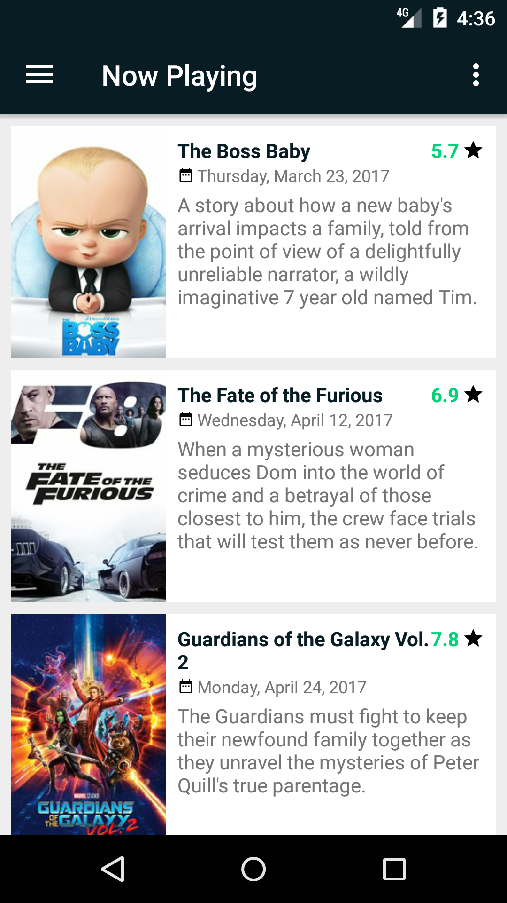

# Pilem

Latihan membuat app android menggunakan API TMDb
* Now Playing
* Upcoming Movies
* Popular Movies
* Top Rated Movies

> Done is better than perfect

### Roadmap
* [x] Explore & test REST API TMDb
* [x] Buat app base design (warna dan atribut lainnya dari TMDb)
* [x] Implement Model View Presenter (MVP)
* [x] Lazy load image
* [x] Endless Scrolling
* [x] Fragment List
* [ ] Detail Movie
* [ ] Swipe Refresh

### Dependencies
* [Retrofit][retrofit_repo_url]
* [google-gson][gson_repo_url]
* [picasso][picasso_url]

### References
* [TMDb Developer][tmdb_url]
* [Android Guidelines][adgl_url]
* [Architecture of Android Apps][archi_ar_url]
* [Beginning Android Resources][res_ar_url]
* [Using the RecyclerView][rv_link]
* [Endless Scrolling][el_sc_link]
* [A View Divided][view_divided_link]
* [Displaying Images with the Picasso Library][picasso_ref_url]
* [Creating and Using Fragments][using_fragment_url]
* [Set a click listener to a RecyclerView][item_selected_listener_url]

[tmdb_url]: https://developers.themoviedb.org
[adgl_url]: https://github.com/ribot/android-guidelines
[archi_ar_url]: https://guides.codepath.com/android/Architecture-of-Android-Apps
[res_ar_url]: https://guides.codepath.com/android/Beginning-Android-Resources
[retrofit_repo_url]: https://github.com/square/retrofit
[gson_repo_url]: https://github.com/google/gson
[picasso_url]: https://github.com/square/picasso
[rv_link]: https://guides.codepath.com/android/Using-the-RecyclerView
[el_sc_link]: https://guides.codepath.com/android/Endless-Scrolling-with-AdapterViews-and-RecyclerView
[view_divided_link]: https://www.bignerdranch.com/blog/a-view-divided-adding-dividers-to-your-recyclerview-with-itemdecoration/
[picasso_ref_url]: https://guides.codepath.com/android/Displaying-Images-with-the-Picasso-Library
[using_fragment_url]: https://guides.codepath.com/android/Creating-and-Using-Fragments
[item_selected_listener_url]: https://antonioleiva.com/recyclerview-listener/
